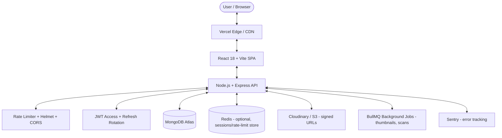

# 🚀 Digital Library — MERN Transformation Roadmap (v2, Senior Review)

This is a revised version of the original `Futurework.md`. The overall MERN direction was right — the gaps were mostly in **security, scalability, search strategy, and production-readiness**. Everything below either fixes a real risk in the original plan or upgrades it to something you can actually defend in an interview or a viva.

---

## 🔎 What Changed & Why (Read This First)

| Area | Junior's Plan | Senior Revision | Why It Matters |
|---|---|---|---|
| Auth tokens | JWT, storage unspecified | Access token (short-lived, in memory) + Refresh token (httpOnly cookie) | Storing JWT in `localStorage` is XSS-exploitable. This is the #1 mistake in student MERN projects. |
| Password handling | Not specified | bcrypt (12 rounds) + rate-limited login | Prevents brute force + rainbow table attacks |
| File uploads | Multer → Cloudinary directly | Multer (memory storage) → MIME/magic-byte validation → virus scan hook → Cloudinary | A raw PDF upload endpoint is a malware injection vector if you don't validate file content, not just extension |
| Search | "MongoDB Atlas Search" | MongoDB text index (free tier) as default, Atlas Search as a stretch goal | Atlas Search requires M10+ dedicated cluster in practice for reliable use — not free tier. Don't plan your MVP around a paid feature. |
| State management | Context API only | Context for auth, Zustand/Redux Toolkit for book/reader state | Context re-renders the whole subtree on every update — fine for auth, bad for frequently-changing reading progress |
| Error handling | Not mentioned | Centralized Express error middleware + Winston logging | Without this, debugging production issues means guessing |
| Testing | Not mentioned | Jest + Supertest (API), React Testing Library (UI) | A MERN project with zero tests is a red flag in review |
| API docs | Not mentioned | Swagger/OpenAPI at `/api/docs` | Makes the project demoable and looks professional |
| PDF delivery | Direct Cloudinary URL | Signed, expiring URLs | Prevents anyone with the link from bypassing auth and scraping your PDF library |
| Deployment | Vercel + Render | Same, + Docker Compose for local dev parity | Avoids "works on my machine" |
| Observability | Not mentioned | Sentry (errors) + simple analytics events | You can't fix what you can't see |

---

## 🏗️ 1. Target System Architecture



**Key architectural decision points to be ready to explain:**
- Why REST over GraphQL here → simpler CRUD surface, no deeply nested query needs, faster to ship for this scope.
- Why MongoDB over SQL → book/user data is document-shaped (varied metadata, embedded arrays like favorites/reading history), and schema flexibility helps as features grow.
- Why signed URLs over public asset URLs → auth boundary shouldn't stop at the API; anyone with a raw Cloudinary link could otherwise bypass login entirely.

---

## ✨ 2. Feature Breakdown (Revised)

### 🛡️ A. Authentication & RBAC
- Register/login with **bcrypt-hashed passwords** (never store plaintext, never reversibly encrypt).
- **Access token** (15 min expiry, kept in memory/React state) + **Refresh token** (7 day expiry, httpOnly + Secure + SameSite=strict cookie).
- Refresh token rotation: every refresh issues a new refresh token and invalidates the old one (detects token theft).
- Rate-limit `/login` and `/register` (e.g. 5 attempts / 15 min per IP) using `express-rate-limit`.
- Roles: `student`, `faculty`, `admin` — enforced via middleware, not just hidden UI (hiding a button is not access control).
- Email verification on register (optional stretch: nodemailer + a verification token).

### 📖 B. Embedded PDF Reader
- `react-pdf` / PDF.js viewer, but **PDF served via short-lived signed URL** (5–10 min expiry), not a permanent public link.
- Reading progress **debounced** client-side (save every 5s or on page change, not on every scroll event) to avoid hammering the API.
- Bookmarks and notes stored per-user, per-book — separate lightweight collection, not embedded in `User` (keeps the user doc from growing unbounded).

### 🔍 C. Search & Filtering (Realistic Plan)
- **MVP**: MongoDB native `text` index on `title`, `author`, `subject`, `tags` — free, works on M0 tier, good enough for a catalog of hundreds–low thousands of books.
- **Stretch goal**: Atlas Search (fuzzy, weighted, autocomplete) once/if you're on a dedicated cluster — document this as a "future upgrade," not a v1 dependency.
- Compound filters: year + subject + resource type using standard indexed queries, not full scans.

### 📊 D. Dashboards
- User: continue-reading shelf, favorites, stats — all read from indexed queries, paginated (never `find()` everything and paginate client-side).
- Admin: upload panel, analytics, moderation queue — protect every admin route with role middleware **and** re-validate ownership server-side on update/delete (don't trust a book ID passed from the client without checking `uploadedBy` or role).

### 🔔 E. New: Notifications (Stretch)
- New book in your subject/year → in-app notification (simple polling or Socket.IO if you want to show real-time skills).

### 📱 F. New: PWA / Offline Shelf (Stretch)
- Service worker caches last-read pages so students can keep reading with poor college wifi. Strong differentiator for a "digital library" pitch.

---

## 🗄️ 3. MongoDB Schemas (Hardened)

### `User.js`
```javascript
const mongoose = require('mongoose');
const bcrypt = require('bcrypt');

const userSchema = new mongoose.Schema({
  name: { type: String, required: true, trim: true, maxlength: 100 },
  email: { type: String, required: true, unique: true, lowercase: true, trim: true },
  password: { type: String, required: true, select: false }, // never returned by default
  role: { type: String, enum: ['student', 'faculty', 'admin'], default: 'student' },
  avatar: { type: String, default: '' },
  isVerified: { type: Boolean, default: false },
  refreshTokenVersion: { type: Number, default: 0 }, // bump to invalidate all refresh tokens (e.g. on password change)
  favorites: [{ type: mongoose.Schema.Types.ObjectId, ref: 'Book' }],
}, { timestamps: true });

userSchema.pre('save', async function (next) {
  if (!this.isModified('password')) return next();
  this.password = await bcrypt.hash(this.password, 12);
  next();
});

userSchema.methods.comparePassword = function (candidate) {
  return bcrypt.compare(candidate, this.password);
};

module.exports = mongoose.model('User', userSchema);
```

### `ReadingProgress.js` *(split out of User — this was the biggest schema smell in the original)*
```javascript
const mongoose = require('mongoose');

const readingProgressSchema = new mongoose.Schema({
  user: { type: mongoose.Schema.Types.ObjectId, ref: 'User', required: true, index: true },
  book: { type: mongoose.Schema.Types.ObjectId, ref: 'Book', required: true },
  lastPageRead: { type: Number, default: 1 },
  totalPages: { type: Number, default: 1 },
  bookmarks: [{ page: Number, note: String, createdAt: { type: Date, default: Date.now } }],
}, { timestamps: true });

readingProgressSchema.index({ user: 1, book: 1 }, { unique: true }); // one progress doc per user/book pair

module.exports = mongoose.model('ReadingProgress', readingProgressSchema);
```

### `Book.js`
```javascript
const mongoose = require('mongoose');

const bookSchema = new mongoose.Schema({
  title: { type: String, required: true, trim: true },
  author: { type: String, required: true, trim: true },
  description: { type: String, required: true },
  category: {
    type: String,
    enum: ['1st Year', '2nd Year', '3rd Year', '4th Year', 'General Knowledge', 'Reference'],
    required: true,
  },
  branch: { type: String, default: 'Computer Engineering' },
  subject: { type: String, required: true },
  tags: [{ type: String, index: true }],
  coverImage: { type: String, required: true },
  pdfPublicId: { type: String, required: true }, // Cloudinary public_id — used to generate signed URLs on demand, never store the raw URL
  fileSize: { type: String },
  totalPages: { type: Number },
  uploadedBy: { type: mongoose.Schema.Types.ObjectId, ref: 'User', required: true },
  isApproved: { type: Boolean, default: false }, // admin approval gate before it's publicly visible
  viewsCount: { type: Number, default: 0 },
  downloadsCount: { type: Number, default: 0 },
  averageRating: { type: Number, default: 0, min: 0, max: 5 },
  reviewsCount: { type: Number, default: 0 },
  isDeleted: { type: Boolean, default: false }, // soft delete — never hard-delete content with reviews/history attached
}, { timestamps: true });

bookSchema.index({ title: 'text', author: 'text', subject: 'text', tags: 'text' });

module.exports = mongoose.model('Book', bookSchema);
```

### `Review.js`
```javascript
const mongoose = require('mongoose');

const reviewSchema = new mongoose.Schema({
  book: { type: mongoose.Schema.Types.ObjectId, ref: 'Book', required: true, index: true },
  user: { type: mongoose.Schema.Types.ObjectId, ref: 'User', required: true },
  rating: { type: Number, required: true, min: 1, max: 5 },
  comment: { type: String, required: true, maxlength: 1000 },
}, { timestamps: true });

reviewSchema.index({ book: 1, user: 1 }, { unique: true }); // one review per user per book

module.exports = mongoose.model('Review', reviewSchema);
```

---

## 📡 4. REST API Specification (Revised)

### Auth (`/api/v1/auth`)
- `POST /register` — validate input (Joi/Zod), hash password, send verification email
- `POST /login` — rate-limited, returns access token in body + refresh token as httpOnly cookie
- `POST /refresh` — rotates refresh token, issues new access token
- `POST /logout` — invalidates refresh token (bump `refreshTokenVersion`)
- `GET /me` — requires access token

### Books (`/api/v1/books`)
- `GET /` — search (`?q=`), filters, pagination (`?page=&limit=`), sort — **always paginated, never unbounded**
- `GET /:id` — detail + atomic view-count increment (`$inc`, not read-then-write)
- `POST /` — faculty/admin only, Multer memory storage → MIME + magic-byte validation → upload
- `PUT /:id` — admin or original uploader only (checked server-side)
- `DELETE /:id` — soft delete
- `GET /:id/read-url` — returns a short-lived signed PDF URL (auth required, this is the actual "read" endpoint)

### Users (`/api/v1/users`)
- `POST /favorites/:bookId` — toggle
- `PUT /progress/:bookId` — debounced client-side, upserts `ReadingProgress`
- `GET /dashboard` — aggregated favorites + in-progress + stats (use `$facet` aggregation for one round trip)

### Reviews (`/api/v1/reviews`)
- `GET /book/:bookId`
- `POST /book/:bookId` — one per user per book (schema-enforced), recalculates `averageRating` via post-save hook or aggregation

### Admin (`/api/v1/admin`)
- `GET /users`, `PATCH /users/:id/role`, `GET /books/pending`, `PATCH /books/:id/approve`, `GET /analytics`

All routes versioned under `/api/v1` — makes future breaking changes non-disruptive.

---

## 🔐 5. Security Checklist (Missing Entirely From v1)

- [ ] `helmet` for secure HTTP headers
- [ ] `cors` restricted to your actual frontend origin, not `*`
- [ ] `express-rate-limit` on auth + upload routes
- [ ] Input validation on every route (Joi or Zod) — never trust `req.body` raw
- [ ] Mongoose injection protection (`express-mongo-sanitize`)
- [ ] File upload validation: check MIME type **and** magic bytes (extension alone is spoofable), cap file size (e.g. 25MB)
- [ ] Signed, expiring URLs for all PDF access
- [ ] `.env` never committed — `.env.example` only, secrets in Render/Vercel dashboard
- [ ] HTTPS enforced in production (Render/Vercel handle this, just don't downgrade)
- [ ] Centralized error handler that never leaks stack traces in production responses

---

## 📂 6. Project Directory (Additions Marked ⭐)

```
digital-library/
├── docker-compose.yml           ⭐ local Mongo + Redis parity
├── client/
│   ├── src/
│   │   ├── components/
│   │   ├── context/AuthContext.jsx
│   │   ├── store/               ⭐ Zustand store (book/reader state)
│   │   ├── pages/
│   │   ├── services/api.js      # Axios with interceptor for token refresh
│   │   └── tests/               ⭐ React Testing Library
│   └── package.json
└── server/
    ├── config/
    │   ├── db.js
    │   ├── cloudinary.js
    │   └── logger.js             ⭐ Winston
    ├── controllers/
    ├── middleware/
    │   ├── authMiddleware.js
    │   ├── adminMiddleware.js
    │   ├── rateLimiter.js        ⭐
    │   ├── validate.js           ⭐ Joi/Zod schema validation
    │   ├── errorHandler.js       ⭐ centralized error middleware
    │   └── multerUpload.js
    ├── models/
    ├── routes/
    ├── jobs/                     ⭐ BullMQ workers (thumbnail gen, virus scan)
    ├── tests/                    ⭐ Jest + Supertest
    ├── docs/swagger.yaml         ⭐
    ├── .env.example
    ├── server.js
    └── package.json
```

---

## 📅 7. Phased Execution Plan (Revised, +3 Days for Security/Testing)

| Phase | Duration | Goals |
| :--- | :--- | :--- |
| **Phase 1: Server, DB, Auth** | Days 1–3 | Express + MongoDB setup, hardened schemas, bcrypt + JWT refresh-rotation auth, rate limiting, Helmet/CORS |
| **Phase 2: File Upload Engine** | Days 4–5 | Multer + validation (MIME + magic bytes) → Cloudinary, signed URL generation |
| **Phase 3: React SPA Scaffold** | Days 6–8 | Vite + React + Tailwind, Axios with refresh-token interceptor, Zustand store, React Router |
| **Phase 4: PDF Reader & Search** | Days 9–11 | `react-pdf` viewer against signed URLs, debounced progress tracking, Mongo text-index search + filters |
| **Phase 5: Dashboards & Reviews** | Days 12–13 | User/Admin dashboards (aggregation pipelines), review + rating system |
| **Phase 6: Testing** | Days 14–15 | Jest/Supertest for API, RTL for key components, Swagger docs |
| **Phase 7: Deployment & Observability** | Days 16–17 | Docker Compose for local, deploy to Vercel/Render, wire up Sentry, basic analytics events |

*(~17 days vs. the original 14 — the extra time buys you a project that survives a security review, not just a demo.)*

---

## 🌐 8. Deployment Strategy

- **Database**: MongoDB Atlas M0 (free tier is fine — Atlas Search is the only thing that needs a paid tier, and it's a stretch goal here).
- **Backend**: Render or Railway (both have generous free/hobby tiers for Node).
- **Frontend**: Vercel — auto preview deployments per PR are genuinely useful for a solo/small-team project.
- **Media**: Cloudinary free tier (25 GB storage/bandwidth) — plenty for a college library scope; migrate to S3 + CloudFront only if you outgrow it.
- **Error tracking**: Sentry free tier — set this up on day 1 of Phase 7, not as an afterthought.

---

## 🎯 If You Only Do Three Things From This Revision

1. **Move JWT out of localStorage** into httpOnly refresh cookie + in-memory access token.
2. **Sign your PDF URLs** — don't let auth stop at the API boundary while file storage stays wide open.
3. **Validate uploads by content, not extension**, and cap file size — this is the single easiest thing for someone to exploit in a student MERN project with open uploads.

Everything else here is a quality/scale upgrade; those three are the difference between "works" and "safe to actually deploy publicly."
